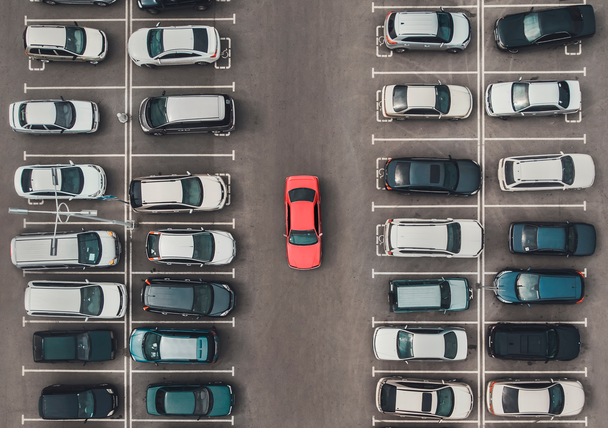
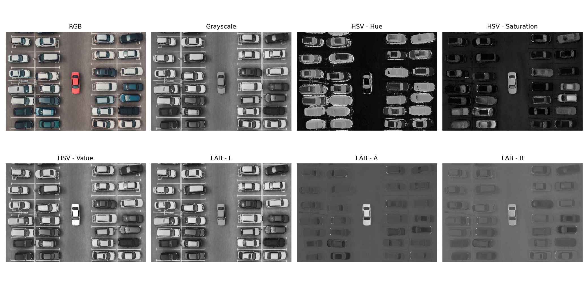
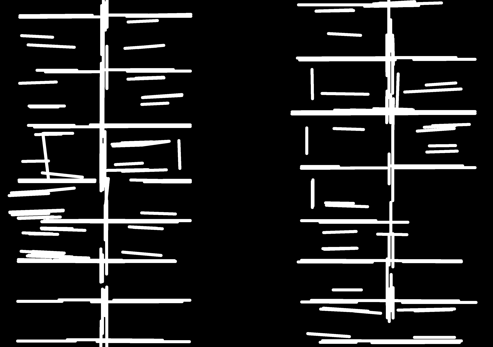
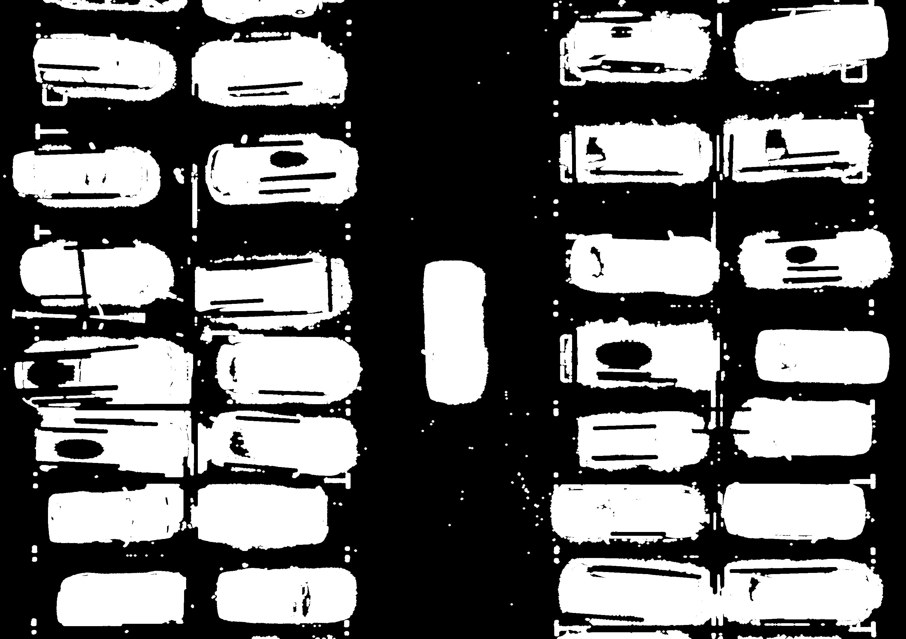
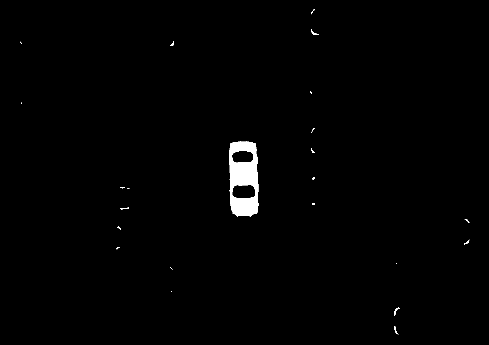
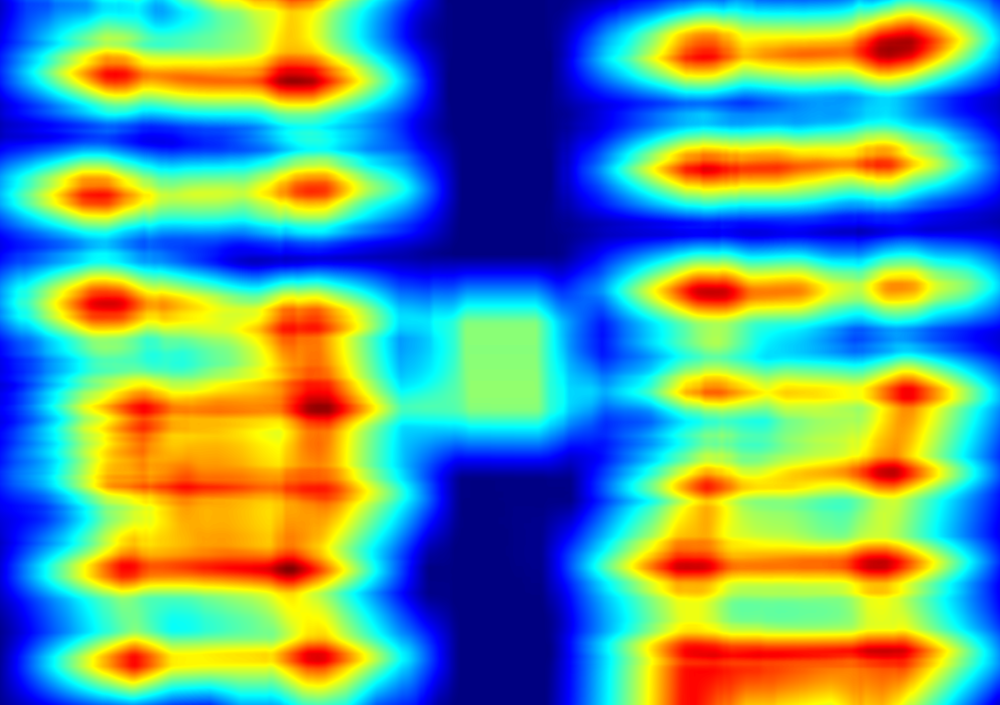
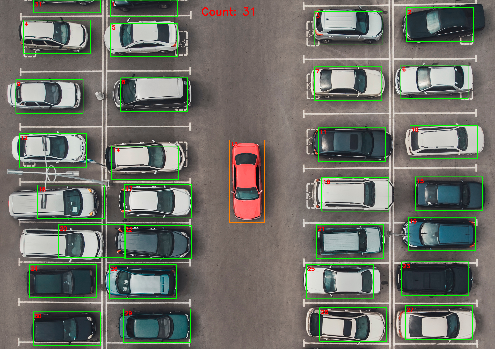

# Mini Project 2: Object Counting
### Mata Kuliah: Pengolahan Citra dan Video

**Nama &nbsp;:** Vinsen Dwi Putra  
**NRP &nbsp;&nbsp;&nbsp;:** 5024241094

---

## Daftar Isi
1. [Overview](#1-overview)
2. [Dependencies](#2-dependencies)
3. [Cara Build dan Run Project](#3-cara-build-dan-run-project)
4. [Object Counting Pipeline](#4-object-counting-pipeline)
5. [Hasil dan Analisis Teknik](#5-hasil-dan-analisis-teknik)

---

## 1. Overview
Proyek ini bertujuan menghitung jumlah mobil pada citra aerial area parkir. Pendekatan yang digunakan adalah pengolahan citra klasik berbasis OpenCV, bukan deep learning. Program membaca citra parkiran, membuat mask kandidat mobil, menghapus gangguan seperti garis parkir putih, lalu menghitung mobil berdasarkan area yang memiliki ciri visual seperti badan mobil, kaca, warna, dan kontras terhadap aspal.

Metode utama yang dipakai adalah kombinasi color space HSV/LAB, thresholding, edge processing, morphology, sliding window, non-maximum suppression, dan contour detection. Dengan pipeline ini, program dapat menghitung mobil tanpa memakai YOLO, model pre-trained, TensorFlow, PyTorch, scikit-image, atau scikit-learn.

## 2. Dependencies
- Python 3.x
- NumPy
- OpenCV (`cv2`)
- Matplotlib

Install library yang dibutuhkan dengan perintah:

```bash
pip install opencv-python numpy matplotlib
```

## 3. Cara Build dan Run Project
Pastikan struktur folder project seperti berikut:

```text
mp2-object-counting/
|-- README.md
|-- counting.py
|-- input/
|   `-- parking.jpg
`-- output/
    |-- result.png
    `-- steps/
        |-- 01_color_space_exploration.png
        |-- 02_parking_line_mask.png
        |-- 03_car_evidence_mask.png
        |-- 04_red_car_mask.png
        `-- 05_sliding_window_score_map.png
```

Jalankan program utama dari root folder project:

```bash
python counting.py
```

Jika ingin menentukan lokasi input dan output secara manual:

```bash
python counting.py --image input/parking.jpg --output output
```

Setelah program selesai, hasil akhir akan tersimpan pada:

```text
output/result.png
```

Visualisasi tiap tahap pipeline tersimpan pada:

```text
output/steps/
```

## 4. Object Counting Pipeline
Pipeline pada proyek ini dibagi menjadi dua bagian utama. Pipeline pertama digunakan untuk mendeteksi mayoritas mobil yang posisinya horizontal. Pipeline kedua digunakan untuk mendeteksi mobil merah yang posisinya vertikal di tengah gambar.

| Tahapan | Visualisasi Citra | Analisis Transformasi |
| :--- | :---: | :--- |
| **Input**<br>Citra Parkiran |  | **Kondisi:** Citra berisi banyak mobil, garis parkir putih, aspal, bayangan, dan beberapa mobil yang terpotong di tepi gambar. Tantangan utamanya adalah membedakan mobil dari garis parkir dan aspal. |
| **Tahap 1**<br>Eksplorasi Color Space |  | **Metode:** Gambar diubah ke RGB, grayscale, HSV, dan LAB.<br>**Efek:** HSV membantu melihat warna dan saturasi mobil, sedangkan LAB dan grayscale membantu melihat perbedaan terang-gelap antara mobil dan aspal. |
| **Tahap 2**<br>Mask Garis Parkir |  | **Metode:** Garis putih dicari dengan threshold HSV, Canny, dan HoughLinesP.<br>**Efek:** Garis parkir dapat dipisahkan sehingga tidak ikut dihitung sebagai mobil. |
| **Tahap 3**<br>Evidence Mask Mobil |  | **Metode:** Mask dibuat dari gabungan kontras lokal, saturasi HSV, dan area gelap pada kanal LAB-L.<br>**Efek:** Bagian mobil seperti bodi, kaca, dan warna mobil menjadi lebih menonjol dibandingkan aspal. |
| **Tahap 4**<br>Mask Mobil Merah |  | **Metode:** Warna merah dipisahkan menggunakan dua range HSV, lalu dibersihkan dengan morphology dan contour filtering.<br>**Efek:** Mobil merah di tengah gambar dapat dideteksi secara khusus karena posisinya berbeda dari mayoritas mobil lain. |
| **Tahap 5**<br>Sliding Window Score Map |  | **Metode:** Sliding window menghitung kepadatan evidence mask. Titik dengan skor tinggi dipilih sebagai kandidat mobil, lalu disaring dengan non-maximum suppression.<br>**Efek:** Satu mobil dihitung satu kali, dan area kosong atau garis parkir lebih mudah ditolak. |
| **Output**<br>Bounding Box Mobil |  | **Hasil:** Mobil yang terdeteksi diberi bounding box dan nomor. Total mobil yang dihitung adalah **31 mobil**. |

---

## 5. Hasil dan Analisis Teknik

Hasil akhir program menunjukkan bahwa terdapat:

```text
Total cars: 31
```

Output akhir dapat dilihat pada gambar berikut:


### A. Eksplorasi Color Space
Tahap eksplorasi color space digunakan untuk memahami karakter gambar. Pada gambar parkiran, mobil tidak selalu memiliki warna yang sama. Ada mobil putih, hitam, biru, hijau, dan merah. Karena itu, hanya memakai grayscale saja kurang kuat. HSV membantu menangkap warna dan saturasi, sedangkan LAB membantu melihat perbedaan terang-gelap secara lebih stabil.

### B. Penghapusan Garis Parkir
Garis parkir putih menjadi salah satu sumber false positive karena bentuknya terang dan kontras terhadap aspal. Jika tidak dihapus, garis parkir dapat ikut masuk ke mask kandidat mobil. Untuk mengurangi masalah ini, program membuat mask garis parkir dengan threshold warna putih, Canny, dan HoughLinesP. Mask ini kemudian dikurangi dari mask kandidat mobil.

### C. Evidence Mask Mobil
Evidence mask adalah mask utama yang menunjukkan bagian gambar yang kemungkinan besar adalah mobil. Mask ini dibuat dari tiga petunjuk sederhana: perbedaan terang-gelap terhadap background aspal, saturasi warna, dan area gelap seperti kaca atau mobil hitam. Setelah itu dilakukan morphology opening dan dilation agar noise kecil berkurang dan bagian mobil yang terputus dapat tersambung.

### D. Sliding Window dan Non-Maximum Suppression
Mobil horizontal dideteksi dengan sliding window. Setiap window diberi skor berdasarkan seberapa banyak piksel kandidat mobil di dalamnya. Area dengan skor tinggi dianggap sebagai kandidat mobil. Setelah kandidat ditemukan, non-maximum suppression dipakai agar satu mobil tidak dihitung berkali-kali. Untuk mobil yang terpotong di tepi atas gambar, program memakai window yang lebih pendek khusus area border atas.

### E. Deteksi Mobil Merah
Mobil merah di tengah gambar memiliki orientasi vertikal, sehingga kurang cocok jika hanya mengikuti deteksi mobil horizontal. Karena warnanya sangat menonjol, mobil ini dideteksi secara terpisah dengan threshold HSV warna merah. Setelah mask merah dibuat, program mencari contour dan memfilter berdasarkan area serta aspect ratio.

### F. Kelebihan dan Keterbatasan
Kelebihan pendekatan ini adalah tidak memakai ROI manual per posisi mobil dan tidak memakai model deep learning. Semua proses masih berbasis pengolahan citra klasik yang bisa dijelaskan tahap demi tahap. Namun, karena metode ini berbasis threshold dan ukuran sliding window, parameter masih cukup bergantung pada sudut pandang, resolusi, dan skala gambar. Jika gambar parkiran sangat berbeda, parameter seperti ukuran window, threshold score, dan morphology mungkin perlu disesuaikan lagi.
